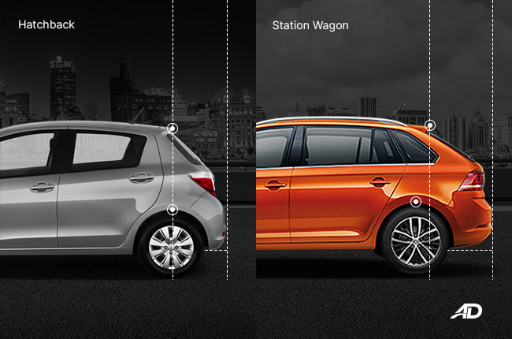

# Supervised Learning

As it name well describes, in supervised learning the algorithm learns with the presence of a supervisor. We feed correctly labeled data to the algorithm and it learns to associate the labels according to the examples provided, so that when unlabeled data is given to the algorithm it helps the user to predict the correct label. 

For example a supervised algorithm could help us sort out vehicles into categories sedan, hatchback, station wagon, minivan, truck, etc. 

image source: autodeal.com.ph

There are two types of supervised learning algorithms: 
* Classification: 
  * Used to separate and label the data into predefined classes or groups. 
  * examples: Image recognition (animals, tree types, bread sorts, etc), handwriting character recognition, facial recognition, etc. 
* Regression: 
  * Used to assign a real value to the data. 
  * examples: weight, house price prediction, etc.

In this Section we explore the following Supervised Learning Algorithms: 
- [The Perceptron](./The-Perceptron)
- [Gradient Descent](./Gradient-Descent)
- [Linear Regression](./Linear-Regression)
- [Logistic Regression](./Logistic-Regression)
- [Neural Networks](./Neural-Networks)
- [K-Nearest Neighbors (KNN)](./K-Nearest-Neighbors)
- [Decision Trees](./Decision-Trees)
- [Ensemble Methods](./Ensemble-Methods)

