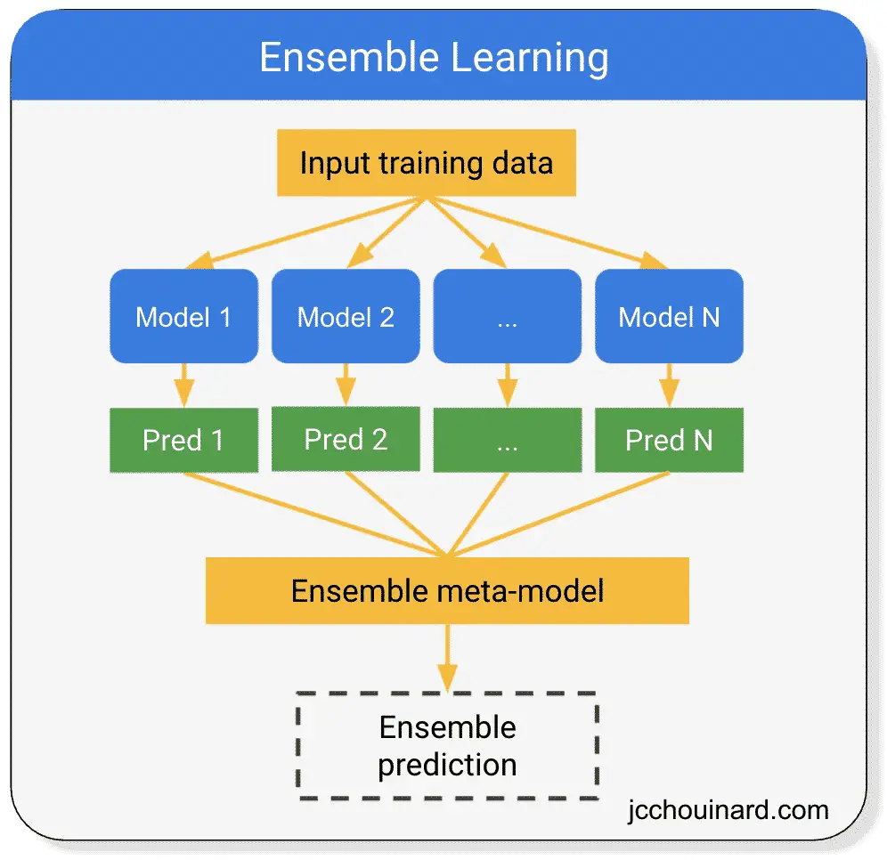

# Ensemble Methods for Predicting Wine Quality

Source: [Ensemble Learning](https://www.jcchouinard.com/ensemble-learning/)

This project utilizes various ensemble machine learning methods to predict wine quality from physicochemical properties using the Wine Quality dataset. The techniques applied, such as Bagging, Random Forests, and Hard Voting Classifiers, are thoroughly explained and demonstrated in the [jupyter notebook](Ensemble_Methods.ipynb) within this subrepository.

In this workbook, we explore different facets of ensemble method implementations. As an educational tool, any issues encountered and insights gained during the model implementation are detailed within the notebook, providing key learning points.

## Dataset
The dataset comprises physicochemical test results from several thousand wines, with features like fixed acidity, volatile acidity, citric acid, residual sugar, and others. The target variable is the quality rating of the wine, scaled from 3 to 8.

This dataset is particularly chosen for its applicative value in educational settings and is available within the notebook environment under the filename `wine_quality.csv`.

## Repository Structure
This subrepository includes:
- A [jupyter notebook](Ensemble_Methods.ipynb) that details the application and analysis of various ensemble methods.
- A PNG image visualizing the concept of ensemble methods.
- This README file.

---
