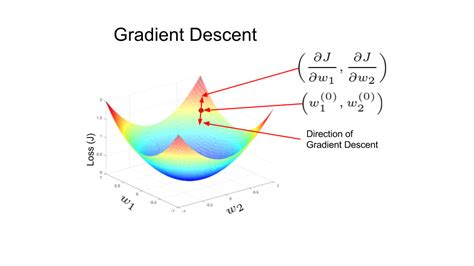

# Gradient Descent for Function Optimization

image source: https://learnopencv.com/

This project explores the gradient descent algorithm, a fundamental optimization technique used to find the minimum of a function. Detailed explanations of the mathematical concepts and Python implementations for both single-variable and multivariable functions are provided in the  inside this subrepository.

Throughout this educational notebook, we explore various aspects of the gradient descent algorithm, including its sensitivity to initial conditions and learning rates. The journey includes troubleshooting common issues such as divergence and slow convergence, offering a practical learning experience.

## Mathematical Functions

The notebook details the optimization of several mathematical functions:
- A single-variable quadratic function, \(x^2\), demonstrating the basic principles of gradient descent.
- Himmelblau's function and a saddle point function, \(x_0^2 - x_1^2\), to illustrate the behavior of gradient descent in more complex scenarios.

Visualizations include 2D and 3D plots that clearly show the paths taken by the gradient descent algorithm in searching for minima.

## Repository Structure

This subrepository contains:
* A  that walks through the gradient descent process.
* A PNG image that visualizes the concept of gradient descent.
* This readme file.

