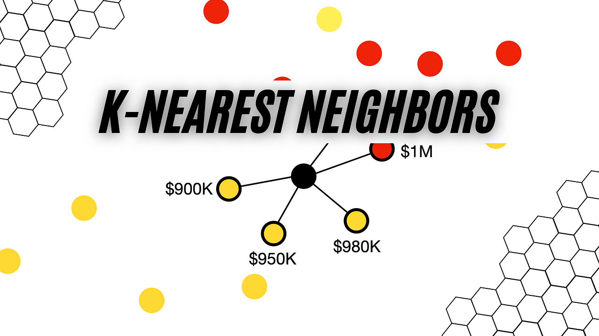

# K-Nearest Neighbors (KNN) for Hotel Booking Cancellations

This project utilizes the K-Nearest Neighbors algorithm to predict whether a hotel booking will be canceled based on historical booking data. The mathematical description and implementation details are provided in the  inside this subrepository.

## Dataset
The dataset comprises 36285 instances, each with features derived from booking information such as lead times, the number of guests, booking prices, and others. The target variable indicates whether the booking was canceled.

The dataset used in this project has been adapted for educational purposes and is contained within the notebook workspace, with the filename `booking.csv`.

## Repository Structure
This subrepository contains:
* A  that details the implementation of the KNN algorithm.
* A PNG image that conceptualizes the KNN model.
* This readme file.

---
