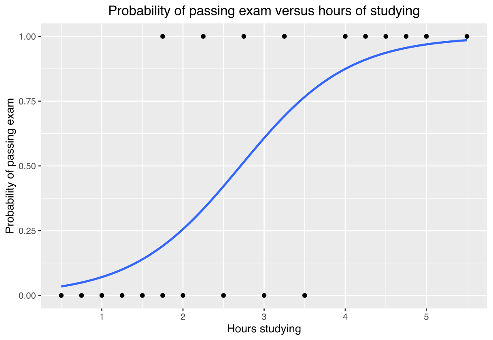

# Logistic Regression in Machine Learning

This project involves using logistic regression to predict heart disease from various clinical parameters. It demonstrates the application of logistic regression, a statistical machine learning method, to a real-world medical dataset. The objective is to identify individuals at higher risk of heart disease based on their medical profiles.

## Dataset
The dataset used in this project contains clinical measures from individuals and an indicator of whether they were diagnosed with heart disease within a ten-year period. Key variables include age, sex, cholesterol levels, blood pressure, and glucose levels, among others. The Dataset was obtained from [Kaggle.com](https://www.kaggle.com/datasets/dileep070/heart-disease-prediction-using-logistic-regression/data)

## Repository Structure
This repository contains the following files: 
* Logistic_Regression.ipynb - Jupyter Notebook detailing the math behind, the preparation and training of a Logistic regression machine learning model. 
* HeartDisease.csv - dataset obtained from kaggle.com with 10 columns: male	age	education	currentSmoker	cigsPerDay	BPMeds	prevalentStroke	prevalentHyp	diabetes	totChol	sysBP	diaBP	BMI	heartRate	glucose	TenYearCHD
* sigmoid.png - sigmoid function image for readme source: Wikipedia https://en.wikipedia.org/wiki/Logistic_regression
