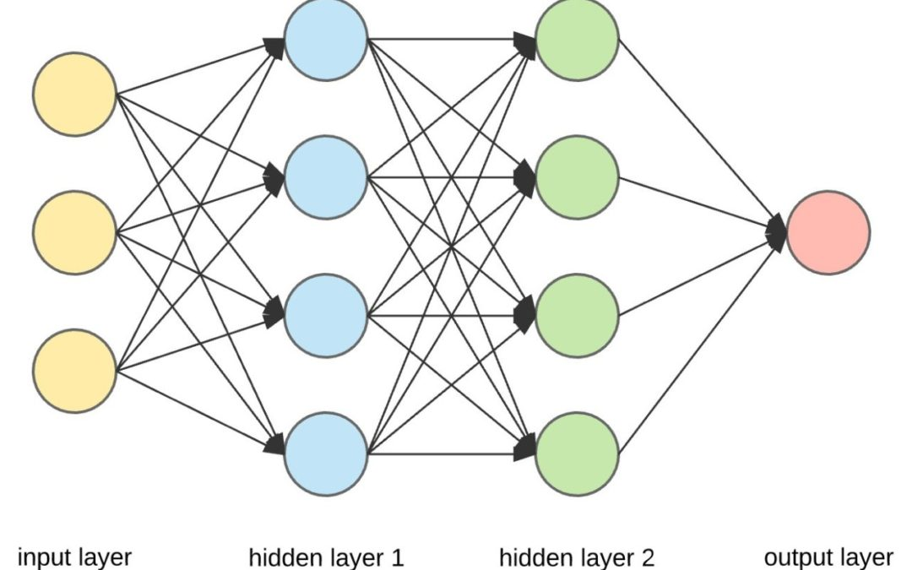

# Neural Network for Image Recognition: Homer vs. Bart

Source: https://devopedia.org/neural-networks

This project involves developing a convolutional neural network (CNN) to classify images as either Homer or Bart Simpson. The entire process, from data preprocessing to model training and evaluation, is detailed in the jupyter notebook within this subrepository.

In the workbook, we explore various aspects of neural network implementation in the context of image recognition. This serves as an educational resource, and any challenges encountered during the model development are documented, providing a practical learning experience.

## Dataset
The dataset consists of images categorized under two classes: Homer and Bart Simpson, participating in various activities. Each image is labeled based on the character it features, with filenames like homerX.bmp or bartX.bmp where X is the file number.

The dataset used in this project is designed for educational purposes and can be accessed directly in the notebook, stored locally in the folder homer_bart. The dataset was obtained from [Kaggle.com](https://www.kaggle.com/datasets/ravinash218/homerbart1/data)

### Repository Structure
This subrepository includes:

* A folder containing the images of Homer and Bart Simpson for identification
* A jupyter notebook detailing the steps taken to build and evaluate the CNN model.
* A PNG image that visually represents the concept of a neural network.
* This README file.