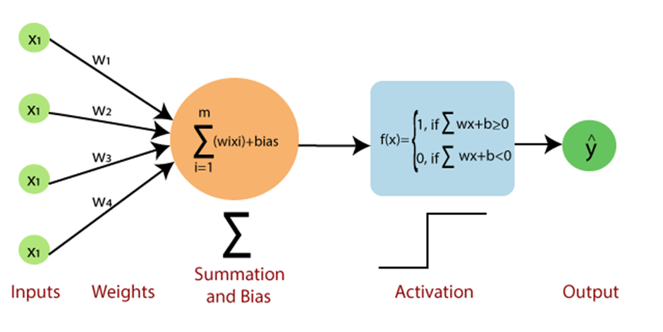

# The Perceptron

  

This project involves using the Perceptron model to discriminate between sonar signals bounced off a metal cylinder and those bounced off a roughly cylindrical rock. 

The Mathematical description, and implementation of the model is found in the  inside this subrepository. 

## Dataset
The Dataset is composed of 208 instances with 60 features and a classification vector. The dataset is loaded from within the notebook workspace.

The dataset has been obtained from the [UC Irvine Machine Learning Repository](https://archive.ics.uci.edu/dataset/151/connectionist+bench+sonar+mines+vs+rocks) directly in the notebook. 

## Repository Structure
This subrepository contains: 
* A  
* A png image of the conceptualization of the Perceptron model
* This readme file