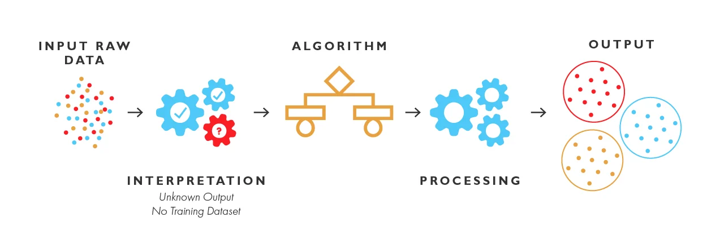

# Unsupervised Learning with K-Means and DBSCAN

This project demonstrates unsupervised learning using the K-Means and DBSCAN algorithms, with a focus on clustering data points into meaningful segments. The mathematical descriptions and implementation details are provided in the [Jupyter notebook](Unsupervised_Clustering.ipynb) inside this repository.

In this workbook, we address the nuances of implementing these algorithms, including challenges and parameter selection. 

## Dataset

The dataset comprises historical data on mall customers, including 200 instances, each with features such as gender, age, annual income, and spending score. These features guide the clustering algorithms in segmenting the dataset.

The dataset was obtained from [Kaggle.com](https://www.kaggle.com/datasets/vjchoudhary7/customer-segmentation-tutorial-in-python/data)

## Repository Structure

This repository contains:
* A dataset called Mall_Customer.csv
* A [Jupyter notebook](Unsupervised_Learning.ipynb) detailing the implementation of K-Means and DBSCAN algorithms.
* A PNG image visualizing the Unsupervised Learning model.
* This README file.

